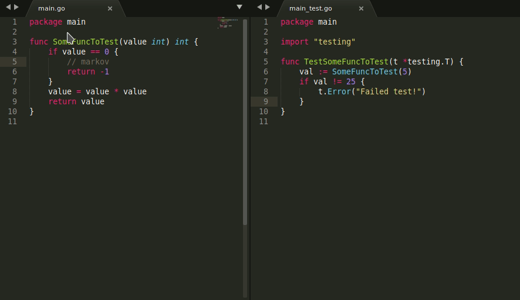

# CoverMe
A Sublime Text 3 Plugin to view code coverage for any programming language's test framework.

This plugin can easily be extended for any testing framework for any programming language.

#### Prograaming languages supported
- Go's `go test`
- Python's `unittest` and `coverage.py`

The basic paradigm followed by the plugin is:
- Run the commands necessary to generate coverage output.
- Parse the coverage output.



## How to install?

1. Clone this repository in your [Packages](https://www.sublimetext.com/docs/3/packages.html) folder.
2. Package Control (under review)

## How to use?

It is pretty easy to use this plugin.

First,
Go to Preferences > Package Settings > CoverMe > Settings - User.

Update the required variables according to the `Settings - Default` file. 

For example, for Go:

```json
"go" : {
	"GOPATH" : "your gopath goes here"
}
```

After this, to view code coverage, press `ctrl+shift+c` (you can override this in keymap) to be presented with various coverage modes, select one and coverage would be presented according to that.

#### Optional : Project level settings
For some projects, you would need to write your own custom coverage modes. To do that, create a new Sublime Project and in the `.sublime-project` file:

```json
{
	"folders":
	[
		{
			"path": "/home/shauryachats/go/src/test_package"
		}
	],
	"settings":
	{
		"CoverMe": {
			"go" : [
				{
					"title": "Custom Coverage Mode",
					"basepath" : "/home/shauryachats/go/src/test_package",
					"commands" : [
						"go test -coverpkg=./... ./... -coverprofile cover.out"
					]
				}
			]
		}
	}
}
```

Under the `settings` key, create a `CoverMe` key containing the list of coverage modes for each programming type.

Each coverage mode is of the form:
```json
{
	"title" : "the title on the quick draw panel",
	"basepath" : "the base path for the project, where the commands are to be run",
	"commands" : "a list of shell commands, which are run to produce coverage information." 
}
```